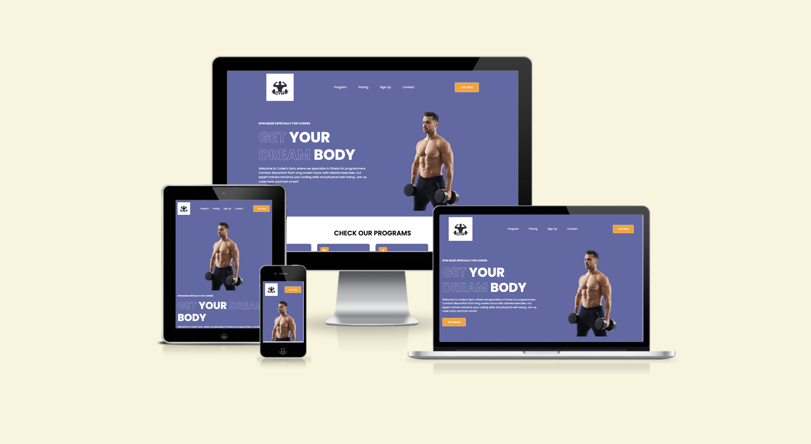
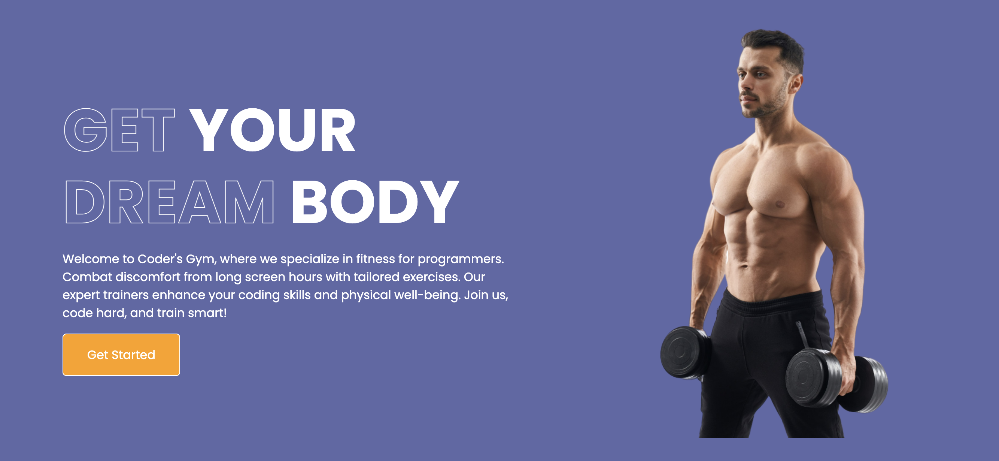
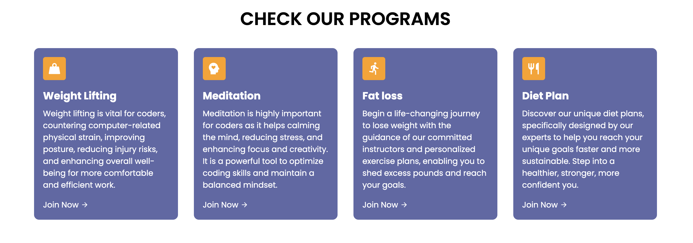
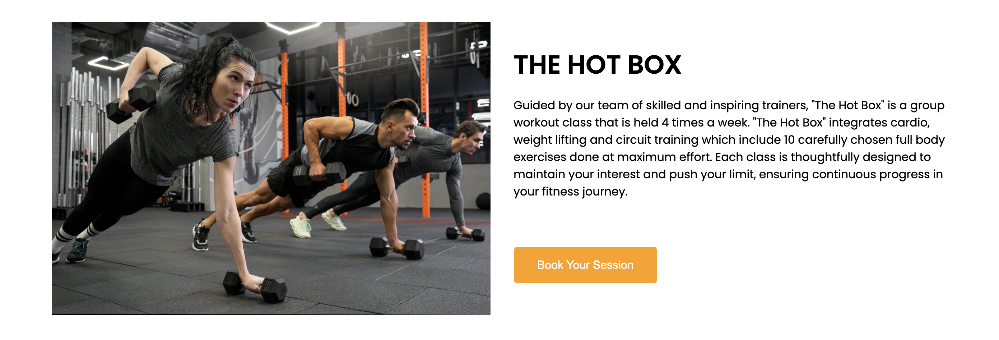
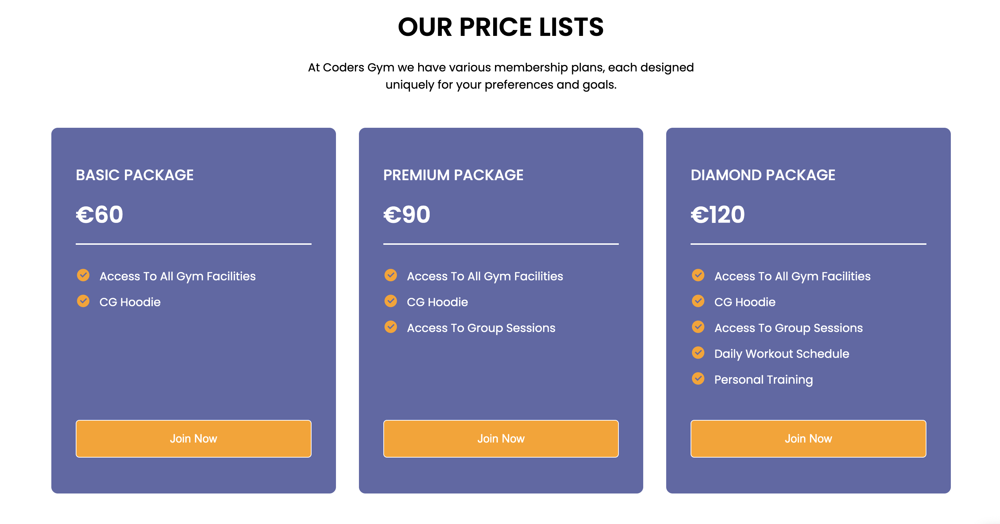
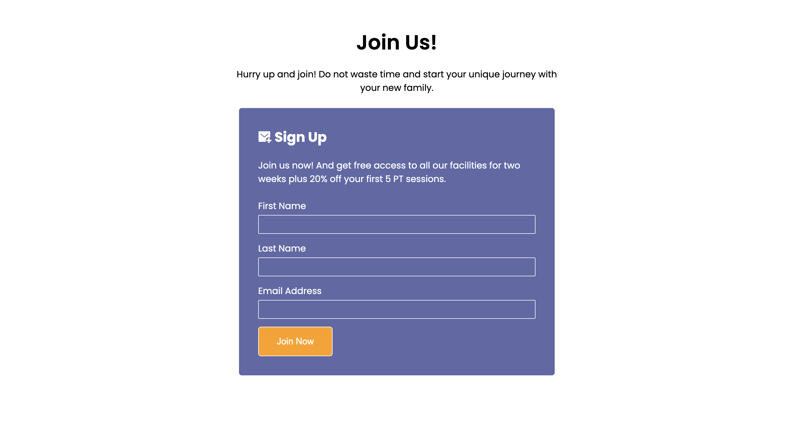
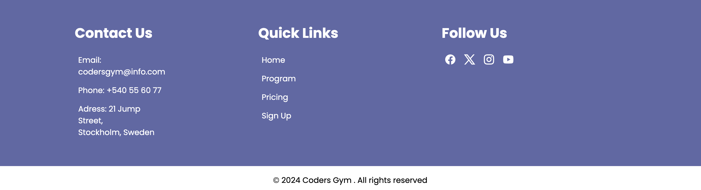

# Coders Gym

Coders Gym is not just your ordinary gym, it's a unique community specifically tailored for coders like you. We understand the challenges that come with coding, and that's why we have created the perfect space for fellow programmers to recharge both mentally and physically. Our trainers at Coders Gym have designed routines that not only counter the strains of coding but also enhance overall well-being, seamlessly blending fitness with coding productivity.

At Coders Gym, our top priority is to provide our clients with a safe and nurturing environment where they can relax both mentally and physically. We believe that by taking care of your well-being, you can recharge and code better. So come join us at Coders Gym, where you can find a supportive community of like-minded individuals who understand the unique demands of coding and are committed to helping you thrive. 

[Live webpage](https://raed-nimer.github.io/CI_PP1_CG/)

# User Stories

### First time user objectives 
- As a first time user, when I open the page I want to be sure that I am on the right page. 
- As a first time user, I want to be able to navigate easily through the website. 
- As a first time user, I want to be able to see what this gym is all about, learn more and contact them. 
- As a first time user, I want to able to navigate through the website on a mobile device.
- As a first time user, I want to be able to find the gym location. 

### Returning user objectives
- As a returning user, I would like to navigate to the right section quickly and easily. 
- As a returning user, I want to be able to find the price lists for the packages offered.
- As a returning user, I want to be able to sign up to the gym community.
- As a returning user, I want to be able to access the gym's social media pages. 

### Navbar

The navigation bar has the gym logo and four links to various page sections such as "Program", "Pricing", "Sign up" and "Contact". When you hover over a link, it will be highlighted with a white underline. Additionally, there's a "Join Now" button that directs users to the sign-up form. 

### Home

Home section includes a hero image, a brief introduction to the website and what it does and a "Get Started" button that takes the user to the sign-up form. 

### Our Programs

This section talks about what qualities CG has to offer its members, such as weight lifting sessions, meditation classes, fat loss programs, diet plans and also why each program was chosen.

### The Hot Box

This is "The hot box" which is a part of the "Our programs" section, talks about CG's special group workout class that is held four times a week and it iclude all the programs above plus circuit style training. 
10 chosen full body exercises done at maximum effort.

### Price Cards

Pricing section consists of three different cards, each card contains a different package such as basic, premium and diamond package: 

- The basic package provides the member with access to all of CG gym facilities and a hoodie.

- The premium package provides the member with access to all of CG gym facilities, hoodie and access to group training. 

- The diamond package provides the member with all of the above plus daily workout schedule and personal sessions with a proffessional trainer. 

### Sign-up Form

The sign-up form is where the user can join the gym community to stay updated on the latest news like changes in opening hours, renovations, outdoor group workouts, and summer trips. It's the user ticket to be in the loop and never miss out on exciting gym activities and events. 

### Footer

The footer consists of three different sections: 

- Contact section provides the user clear contact information and the gym's location. 

- Quick links section consists of four links which are "Home", "Program", "Pricing" and "Sign Up". Each section takes the user to different part of the page. 

- The social media section consist of social media icons which on hover become colorful and the mouse turn into a pointer. The links open in a new tab when clicked.

## Future Features 
- Implementing hamburger menu for responsive navbar, for mobile screens using javascript. 
- Implementing registration system for the gym members. 

## Technologies and languages 
- [HTML](https://web.dev/learn/html/overview/) was used to provide structure for the project
- [CSS](https://developer.mozilla.org/en-US/docs/Web/CSS) was used to style the HTML elements
- [GitHub](https://github.com/) is the platform used to host the code for the website
- [Git](https://git-scm.com/) was used as a version control software to commit and push the code to the GitHub repository
- [Google Chrome Developer Tools](https://developer.chrome.com/docs/devtools/overview/) was used during testing, debugging and making the website responsive
- [W3C HTML Validator](https://validator.w3.org/) was used to check for errors in the HTML code
- [W3C CSS Validator](https://jigsaw.w3.org/css-validator/) was used to check for errors in the CSS code

## Testing 

This website was tested on as many different devices as I was able to find. Including a macbook and desktop pc, iPads 6th and 10th generation, and iPhone SE, iPhone 12 and iPhone 13. Also used a program called [Grammarly](https://www.grammarly.com/) to check for any spelling or typing errors. Detailed actions are listed below. Additionally conducted Google lighthouse and W3C validator testing, results for them are below.
Also made sure that the website is clear, easy to use and valuable for the user.

### Validator Testing 

- HTML
  - Some errors were returned when passing through the official [W3C validator](https://validator.w3.org/nu/?doc=https%3A%2F%2Fraed-nimer.github.io%2FCI_PP1_CG%2F). Mainly typing mistakes and tags wrapping issues. All errors were immediately fixed. 
- CSS
  - Some errors were found when passing through the official [(Jigsaw) validator](https://jigsaw.w3.org/css-validator/validator?uri=https%3A%2F%2Fraed-nimer.github.io%2FCI_PP1_CG%2F%23home&profile=css3svg&usermedium=all&warning=1&vextwarning=&lang=en). All errors were immediately fixed. 
  

    

## Unfixed Bugs

After thorough testing with various online tools and my limited testing with different devices and browsers, all known warnings and errors returned were resolved.

## Deployment

### Deploy with GitHub Pages.

The steps to deploy are as follows:
- Navigate to the [repository](https://github.com/raed-nimer/CI_PP1_CG)
- Click on Settings on the top.
- Click on Pages on the menu on the left which will open GitHub Pages window.
- From the drop down menu under source select deploy from branch.
- From the drop down menu under branch select main, this tells GitHub which branch to use for the deployment. Click Save.
- The page should refresh and the deployment link should appear.

## Credits

 
### Media 
- Hero Image - [Freepik](https://www.freepik.com/free-photo/shirtless-male-bodybuilder-holding-dumbbells_8794728.htm)
- Logo image - [Freepik](https://www.freepik.com/search?format=search&last_filter=query&last_value=gym+logo+black+and+white&query=gym+logo+black+and+white)
- Hot box section image - [Freepik](https://www.freepik.com/free-photo/people-working-out-indoors-together-with-dumbbells_20287182.htm#from_view=detail_alsolike)

### Acknowledgements
- A huge Thank You to my mentor Mo shami for all the advices and resources.
- The Slack Community for their support.

### Comments
I feel like creating this project taught me more than the content of the course, not only to code but also to look for solutions.
One of the biggest lessons I will take with me on future projects is to not give up or get discouraged when things don't go my way.  

[def]: assets/our-programs-view2.png