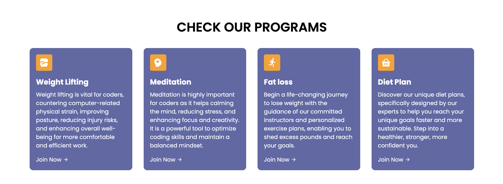

# Coders Gym

Coders Gym is not just your ordinary gym, it's a unique community specifically tailored for coders like you. We understand the challenges that come with coding, and that's why we have created the perfect space for fellow programmers to recharge both mentally and physically. Our trainers at Coders Gym have designed routines that not only counter the strains of coding but also enhance overall well-being, seamlessly blending fitness with coding productivity.

At Coders Gym, our top priority is to provide our clients with a safe and nurturing environment where they can relax both mentally and physically. We believe that by taking care of your well-being, you can recharge and code better. So come join us at Coders Gym, where you can find a supportive community of like-minded individuals who understand the unique demands of coding and are committed to helping you thrive. 

### Navbar

The navigation bar includes the gym logo, four links to different sections of the page sush as program, pricing, sign up form and contact. There's also a "join Now" button that takes the user to the sign up form. 

### Home

Home section includes a hero image, a brief introduction to the website and what it does and a "Get Started" button that takes the user to the sign up form. 

### Our Programs

This section talks about what qualities CG has to offer its members such as weight lifting sessions, meditation classes, fat loss programs, diet plans and also why each program was chosen.

### The Hot Box

This is "The hot box" which is a part of the "Our programs" section talks about CG's special group workout class that is held four times a week and it iclude all the programs above plus circuit style training. 
10 chosen full body exercises done at maximum effort.

### Validator Testing 

- HTML
  - Some errors were returned when passing through the official [W3C validator](https://validator.w3.org/nu/?doc=https%3A%2F%2Fraed-nimer.github.io%2FCI_PP1_CG%2F). Mainly typing mistakes and tags wrapping issues. All errors were immediately fixed. 
- CSS
  - Some errors were found when passing through the official [(Jigsaw) validator](https://jigsaw.w3.org/css-validator/validator?uri=https%3A%2F%2Fraed-nimer.github.io%2FCI_PP1_CG%2F%23home&profile=css3svg&usermedium=all&warning=1&vextwarning=&lang=en). All errors were immediately fixed. 
  

    

